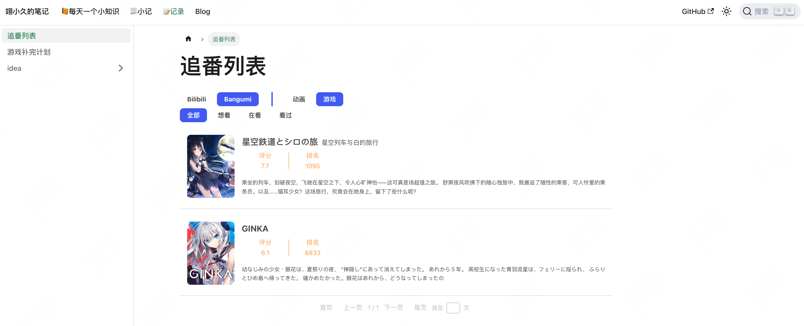
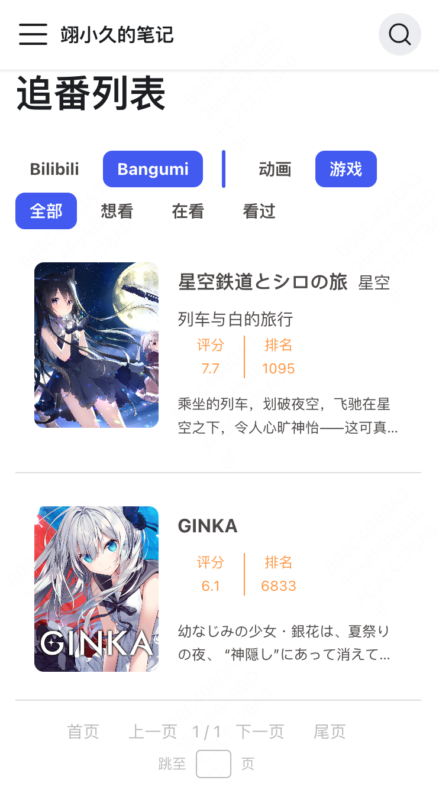

# bilibili-bangumi-component

使用 [WebComponent](https://developer.mozilla.org/zh-CN/docs/Web/API/Web_components) 实现的追番列表组件，支持 Bilibili 与 Bangumi （目前支持动画与游戏）

参考 [hexo-bilibili-bangumi](https://github.com/HCLonely/hexo-bilibili-bangumi)，[Bilibili-Bangumi-JS](https://github.com/hans362/Bilibili-Bangumi-JS)，[Roozen的小破站](https://roozen.top/bangumis)

## 特性

- 💡 使用 WebComponent 实现，可用于任何前端应用
- 🖼️ 支持 Bilibili 与 Bangumi
- 🎨 支持主题设置
- 🔌 支持自定义数据
- 💪 适配移动端

## 展示

展示地址 [https://yixiaojiu-blog.netlify.app/docs/record/bangumi/](https://yixiaojiu-blog.netlify.app/docs/record/bangumi/)

## 文档

这里有视频教程 *⸜( •ᴗ• )⸝* [https://www.bilibili.com/video/BV1ht421W74u](https://www.bilibili.com/video/BV1ht421W74u)

- 使用： [docs/usage.md](docs/usage.md)
- 部署后端： [docs/backend.md](docs/backend.md)
- 自定义数据源： [docs/custom.md](docs/custom.md)

## 第三方集成

- Valaxy: [valaxy-addon-bangumi](https://github.com/YunYouJun/valaxy/tree/main/packages/valaxy-addon-bangumi)
