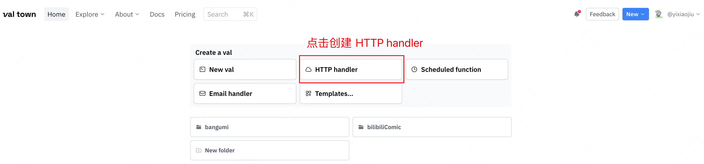
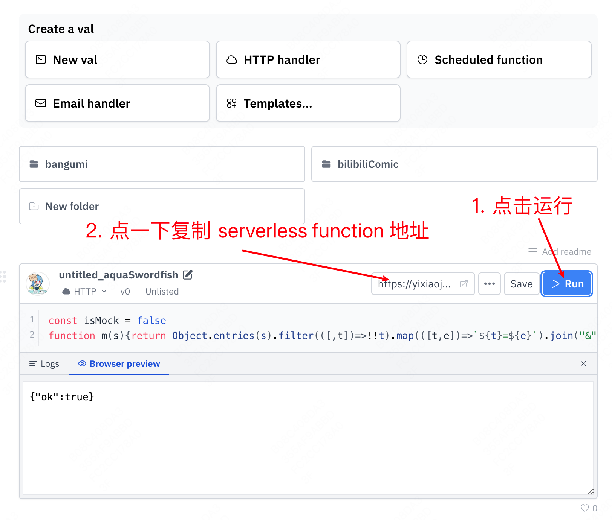
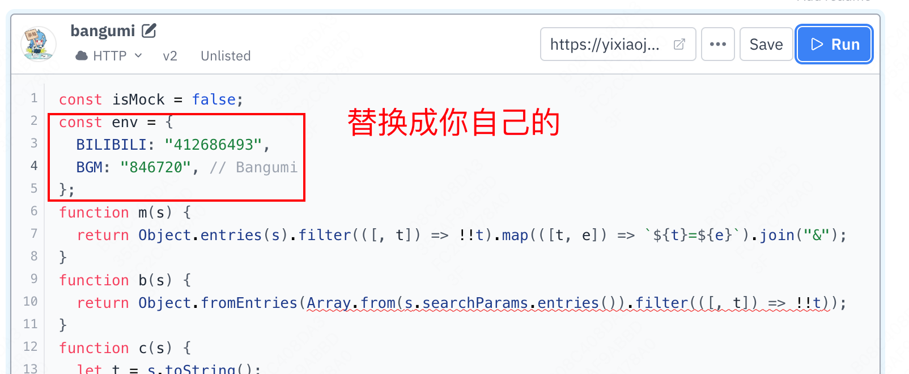
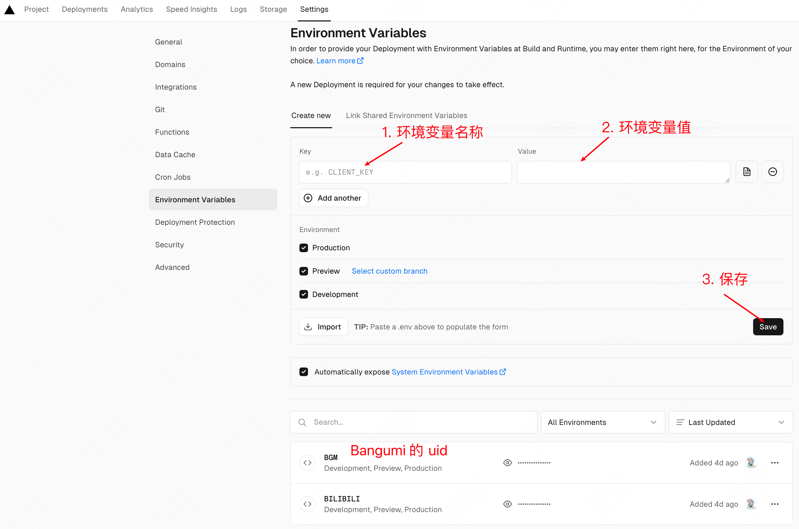

# bilibili-bangumi-component

使用 [WebComponent](https://developer.mozilla.org/zh-CN/docs/Web/API/Web_components) 实现的追番列表组件，支持 Bilibili 与 Bangumi （目前支持动画与游戏）

参考 [hexo-bilibili-bangumi](https://github.com/HCLonely/hexo-bilibili-bangumi)，[Bilibili-Bangumi-JS](https://github.com/hans362/Bilibili-Bangumi-JS)，[Roozen的小破站](https://roozen.top/bangumis)

## 展示

展示地址 [https://yixiaojiu-blog.netlify.app/docs/record/bangumi/](https://yixiaojiu-blog.netlify.app/docs/record/bangumi/)


## 特性

- 使用 WebComponent 实现，可用于任何前端应用
- 支持 Bilibili 与 Bangumi
- 支持主题设置
- 适配移动端

## 使用

### `uid` 获取

下面要用

#### Bilibili

登录哔哩哔哩后前往 [https://space.bilibili.com/](https://space.bilibili.com)页面，网址最后的一串数字就是 `uid`

**需要将追番列表设置为公开！**

#### Bangumi

登录 [Bangumi](https://bangumi.tv/) 后打开控制台(Ctrl+Shift+J)，输入CHOBITS_UID回车，下面会输出 `uid`

### 后端

后端使用 Serverless Function 实现

#### 方案一：使用 val towm

1. 到 [val town](https://www.val.town/) 注册账号

2. 创建一个 HTTP handler


3. 将 [api/val-town.js](api/val-town.js) 中的代码复制到此处



4. （可选）添加 `uid` env



#### 方案二：使用 vercel

**吐槽：** 一开始是以 vercel 的 [Edge Function](https://vercel.com/docs/functions/edge-functions) 为平台进行开发的，结果基本功能都开发完了，部署测试时发现 vercel 域名被墙了，气晕了 😡😡😡。

需要自己想办法解决 vercel 域名被墙的问题

1. fork 本项目，并在 vercel 中导入

2. 设置 `uid` 环境变量（可选）



### 前端

#### 引入

1. 使用 CDN

```html
<script
  type="module"
  src="https://fastly.jsdelivr.net/npm/bilibili-bangumi-component@latest/dist/bilibili-bangumi-component/bilibili-bangumi-component.esm.js"
></script>
```

2. 使用包管理工具

```sh
npm i bilibili-bangumi-component
# or
yarn add bilibili-bangumi-component
# or
pnpm add bilibili-bangumi-component
```

#### 使用组件

使用包管理工具引入需要先注册组件

在任意 js 代码中执行

```js
import { defineCustomElements } from 'bilibili-bangumi-component/loader'

defineCustomElements()
```

在任意 html 中使用组件

```html
<!-- 在后端中引入 uid 的 env 后，不需要设置 bilibili 与 bangumi uid -->
<bilibili-bangumi api="api地址" bilibili-uid="bilibili uid" bgm-uid="bangumi uid"></bilibili-bangumi>
```

#### react 使用示例

```jsx
import { defineCustomElements } from 'bilibili-bangumi-component/loader'

defineCustomElements()

export function Bangumi() {
  return (
    <bilibili-bangumi api="api地址" bilibili-uid="bilibili uid" bgm-uid="bangumi uid"></bilibili-bangumi>
  )
}
```

#### 样式覆盖

由于使用了 [Shadow DOM](https://developer.mozilla.org/zh-CN/docs/Web/API/Web_components/Using_shadow_DOM)，因此样式覆盖有一点点麻烦。

由于使用了 [@layer 级联层](https://developer.mozilla.org/zh-CN/docs/Web/CSS/@layer)，所以覆盖样式时不需要担心 CSS 优先级问题

```js
const bilibiliBangumi = document.querySelector('bilibili-bangumi')
const style = document.createElement('style')
style.textContent = `
/* 编写需要覆盖的样式 */

.bbc-tab-item {
  color: #ccc;
}
`
bilibiliBangumi.attachShadow.appendChild(style)
```

#### 主题

可以直接用标签选择器 `bilibili-bangumi` 进行覆盖

```css
bilibili-bangumi {
  /* 基础文本 */
  --bbc-text-base-color: #4c4948;
  /* 内容信息的文本 */
  --bbc-text-primary-color: #2fd8d8;
  /* 下划线之类的 */
  --bbc-primary-color: #425aef;
}
```

#### 常见问题

[https://vue-quarkd.hellobike.com/#/zh-CN/guide/notice](https://vue-quarkd.hellobike.com/#/zh-CN/guide/notice)

## Api

### 组件

| 字段           | 描述                                     |
|:--------------:|:----------------------------------------:|
| api          | 后端 api 地址                              |
| bilibili-uid | Bilibili 的 uid，在后端中引入 uid 的 env 后可以不设置 |
| bgm-uid      | Bangumi 的 uid，在后端中引入 uid 的 env 后可以不设置  |

## TODO

- [ ]: UI 优化
- [ ]: 自建服务器部署
- [ ]: tab 栏展示配置
- [ ]: 支持 Bangumi 书籍收藏展示
- [ ]: 支持添加展示数据
