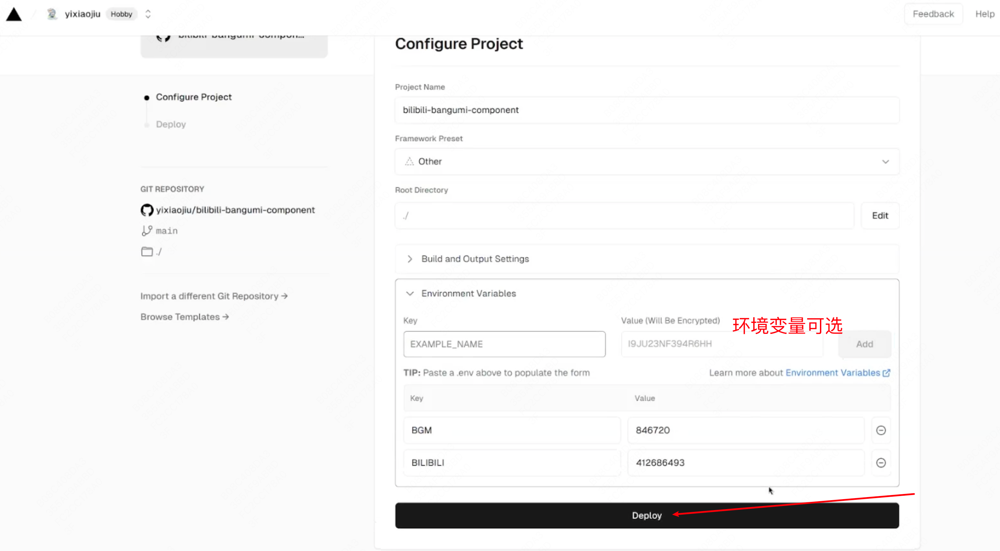
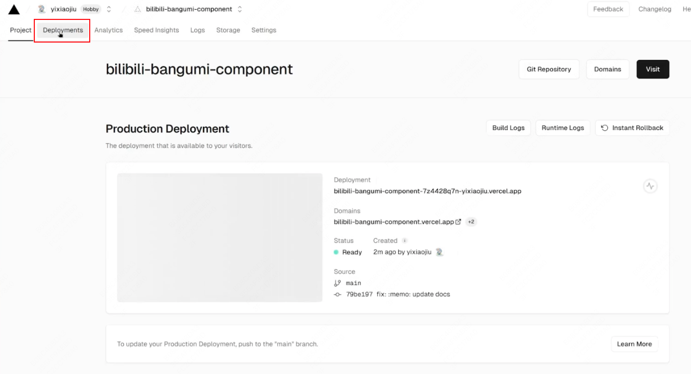
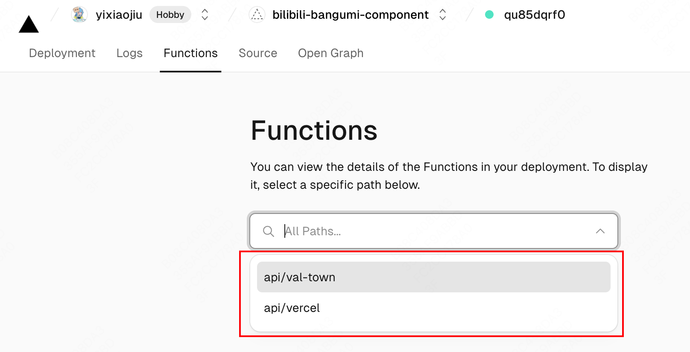
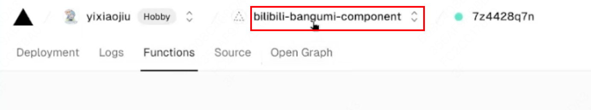
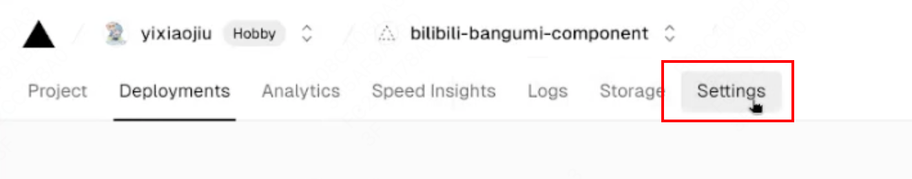
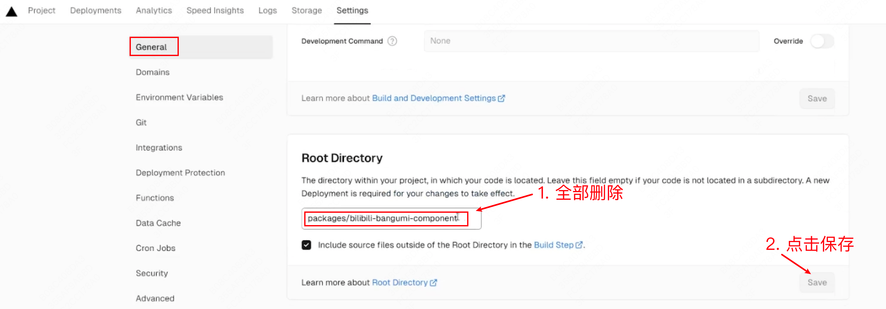
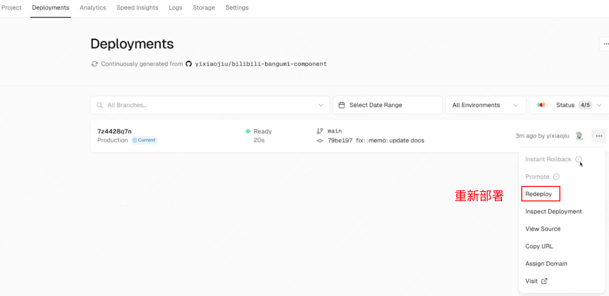

# 后端

后端使用 Serverless Function 实现

#### 方案一：使用 val towm

1. 到 [val town](https://www.val.town/) 注册账号

2. 创建一个 HTTP handler

3. 将 [api/val-town.js](api/val-town.js) 中的代码复制到此处

4. （可选）添加 `uid` env

#### 方案二：使用 vercel

**吐槽：** 一开始是以 vercel 的 [Edge Function](https://vercel.com/docs/functions/edge-functions) 为平台进行开发的，结果基本功能都开发完了，部署测试时发现 vercel 域名被墙了，气晕了 😡😡😡。

需要自己想办法解决 vercel 域名被墙的问题

1. fork 本项目，并在 vercel 中导入

2. 构建配置，并点击 Deploy

3. 检查构建记录中是否注册了 Functions

4. 如果构建记录中没有 Functions，则是部署资源的根目录出了问题 （如果有 Functions，直接跳过这一步）

**注意：** vercel 的接口需要加上 `/api` 路径，例如：`https://xxxx.vercel.app/api`
