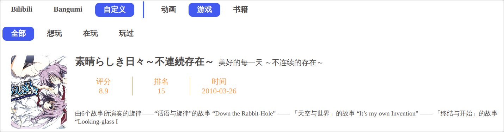
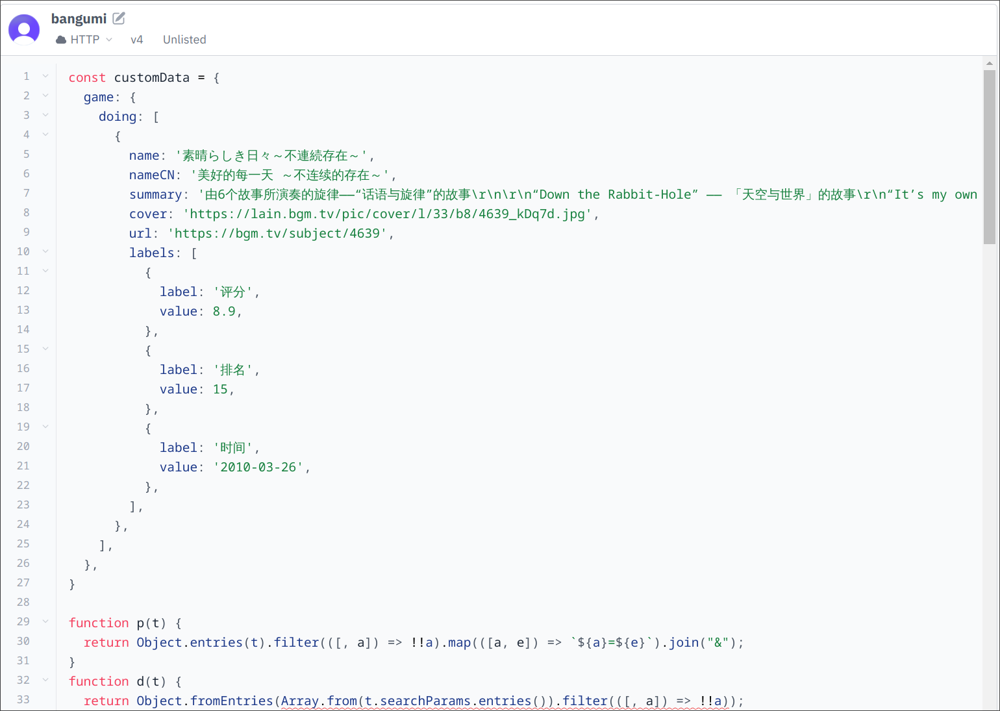

# 自定义数据

效果：



## 后端

把数据定义在 JS 对象（与 JSON 的语法互通）中，然后放到 Serverless Function 的代码中，非常苯的方法 🥹

示例代码 [packages/api/src/mock/custom.js](/packages/api/src/mock/custom.js)

下面是 `customData` 的 ts 类型：

```ts
interface CustomData {
  // 动画
  anime?: CollectionData
  // 游戏
  game?: CollectionData
  // 书籍
  book?: CollectionData
}
// 以动画为例：想看、在看、看过
interface CollectionData {
  want?: ListItem[]
  doing?: ListItem[]
  done?: ListItem[]
}
interface ListItem {
  // 名称
  name?: string
  // 中文名
  nameCN?: string
  // 简介
  summary: string
  // 封面
  cover?: string
  // 链接
  url: string
  // 标签
  labels: LabelItem[]
}
interface LabelItem {
  // 标签名
  label: string
  // 标签值
  value?: string | number
}
```

例如放到 `Val Town ` 中，多余的字段可以删掉



由于 `vercel` 是通过 fork 本仓库进行部署的，因此需要把 `customData` 对象放到以下路径的代码中：[api/vercel.js](/api/vercel.js)，然后提交更改。

## 前端

启用自定义数据源

```html
<bilibili-bangumi custom-enabled="true" custom-label="自定义"></bilibili-bangumi>
```
